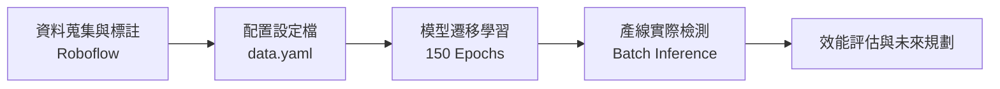

```markdown
# 📦 自動化紙袋封口瑕疵檢測系統 (Paper Bag Defect Detection)


## 📝 專案簡介
本專案旨在建置一個基於深度學習物件偵測技術的**自動化紙袋封口區域瑕疵檢測系統**。傳統人工檢查不僅耗時、耗費人力成本，且檢測品質極易受到主觀因素影響，難以維持產線穩定的檢測標準。

為提升檢測效率與產品控管的一致性，本專案導入 YOLO 物件偵測框架進行端到端（End-to-End）的影像辨識，針對紙袋封口產線常見的三大缺陷進行精準定位：
* **彎曲 (Bent)**：封口折歪或角度異常。
* **破損 (Tear)**：材質撕裂或邊緣破損。
* **皺褶 (Wrinkle)**：表面不平整與嚴重壓皺。

---

## 🛠️ 開發工具與環境
* **深度學習框架**：Ultralytics YOLO 框架
* **硬體加速平台**：Google Colab (搭載 Tesla T4 GPU 運算加速)
* **資料集管理與標註**：Roboflow 電腦視覺雲端平台
* **核心軟體環境**：Python 3.12+ / torch-2.9.0+cu126 / CUDA:0

---

## 📊 系統流程 (System Flow)



1. **資料標註與前處理**：利用 Roboflow 平台定義瑕疵標籤。初始資料集包含 **233 張圖片**，全面重塑尺寸至 `640x640`。
2. **資料增強 (Data Augmentation)**：為克服工業現場真實反光、拍攝角度與環境雜訊的干擾，資料集套用了 **50% 機率水平/垂直翻轉** 以及 **-15 到 +15 度的隨機旋轉**，大幅擴充樣本多樣性。
3. **環境配置**：撰寫 `data.yaml` 定義訓練集、驗證集與測試集路徑、類別總數 `nc: 3` 與標籤對應名稱。
4. **模型訓練**：於 GPU 環境下載入預訓練權重，進行 150 個 Epoch 的深度遷移學習。
5. **批量推論**：編寫隨機批量預測腳本，動態抓取影像進行信心度（Confidence）門檻 0.25 的缺陷偵測驗證。

---

## 📈 訓練結果與深入評估

根據模型訓練所產生的數據圖表（`results.png`）進行深度解讀：

* **訓練集 Loss 表現**：在訓練階段，模型的 `train/box_loss`（邊框損失）、`train/cls_loss`（分類損失）與 `train/dfl_loss` 皆呈現穩定且顯著的下降趨勢，證實模型成功捕捉到紙袋瑕疵的幾何與紋理特徵。
* **驗證集盲點分析（過擬合現象）**：觀察驗證集指標可以發現，`val/box_loss` 與 `val/cls_loss` 在訓練中後期（約 50 Epoch 後）出現不降反升的震盪現象。同時，`metrics/mAP50(B)` 最終收斂於大約 `0.35 ~ 0.4` 之間。
* **改進空間**：此波動特徵反映出經典的**過擬合 (Overfitting)** 狀態，主要受限於初始影像總樣本數較少。雖然目前模型已具備產線缺陷的初步篩查能力，但泛化效能仍有大幅提升的空間。

---

## 📂 專案檔案結構 (Project Directory Structure)

```text
paperbag-defect-detection/
├── .gitignore               # Git 忽略檔案清單（已設定自動過濾大檔案與暫存）
├── README.md                # 專案詳細說明文件（本檔案）
├── data.yaml                # YOLO 資料集路徑與 3 類瑕疵標籤設定檔
├── README.dataset.txt       # Roboflow 資料集來源與 CC BY 4.0 授權說明
├── README.roboflow.txt      # Roboflow 導出規格紀錄（影像增強與解析度規格參數）
└── 紙袋檢測.ipynb            # Google Colab 完整核心執行腳本（含掛載、訓練、推論展示）

```

---

## 🔮 未來規劃 (Future Work)

1. **持續擴充真實樣本**：計劃蒐集更多元、高品質的工業現場真實瑕疵影像，擴大資料集基數以直接提升模型的泛化能力與辨識精準度（mAP）。
2. **加入提早停止機制 (Early Stopping)**：在模型訓練設定中加入 `patience` 參數，當驗證集損失連續數個 Epoch 未下降時主動中斷訓練，以有效抑制中後期的過擬合問題。
3. **邊緣端與硬體整合**：結合即時工業相機擷取設備與自動化流水線，朝向智慧製造產線端「即時落地部署」的自動化即時檢測系統發展。

---

## 👥 團隊成員與致謝

* **學校機構**：東海大學 (Tunghai University) -  AI 影像品質檢測運用技術與實務
* **組別成員**：第四組
* 江禮 (sl1490086)
* 楊至翰 (sll490088)
* 籃上淵 (sll490075)
* 林暉恩 (sll490078)


特別感謝指導老師開設本門課程，使我們能夠將電腦視覺與深度學習理論知識實際應用於工業視覺檢測的專案實作中，對於智慧製造與 AI 工業應用有了更深層次的理解。

```

```
